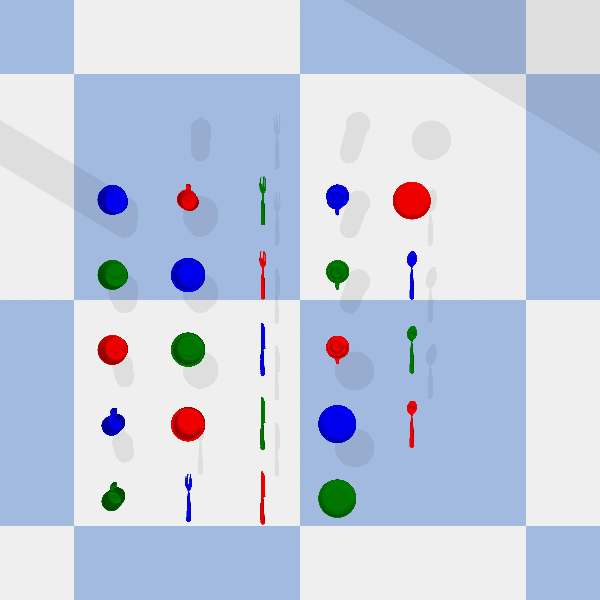
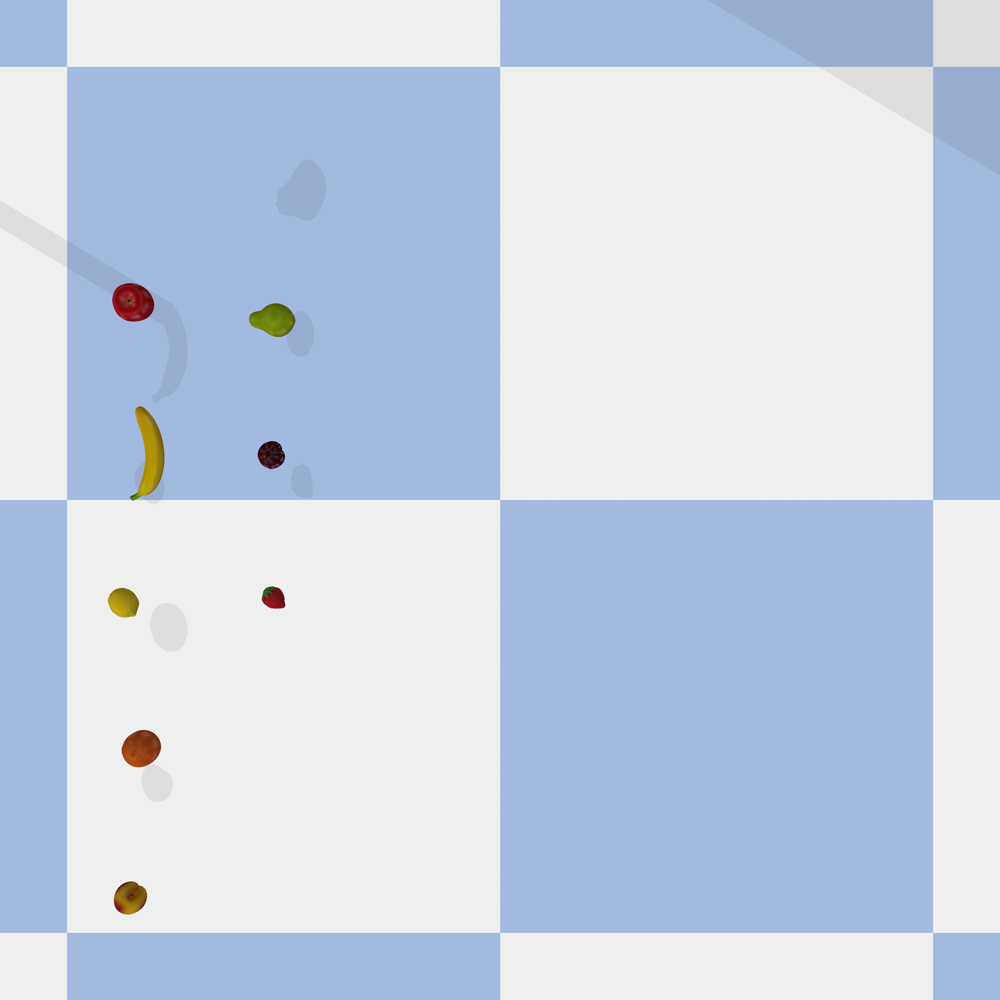

# URDF_models

This project is forked from [pybullet-URDF-models](https://github.com/ChenEating716/pybullet-URDF-models). Thanks for the author's effort.

A collection of URDF models for Pybullet. This repo is continually updated!
- Utensil

    

- Furniture
- Food

    

